

<!-- HEADER -->

<table width="100%">
<tr>
<td width="30%" align="center">
  <!-- Uploaded profile image -->
  
</td>
<td width="70%" valign="top">
  <h1>Hello, world! 🌐</h1>
  

    I’m <b>Shania Bugahod</b>, a student developer passionate about building innovative software and hardware projects.
    I enjoy creating web systems, integrating electronics, and exploring new technologies.
  

  

    🔹 Interests: Web Development, Arduino, RFID Systems 
    🔹 Currently learning: Full-Stack Development 
    🔹 Goal: Build useful and real-world systems
  

</td>
</tr>
</table>

---

<!-- STATS BOX -->

<table width="100%">
<tr>
<td width="50%" align="center">

### ▢ GitHub Stats

</td>
<td width="50%" align="center">

### ▢ GitHub Streak

</td>
</tr>
</table>

<!-- CONTRIBUTIONS BOX -->

### ▢ Contributions

---

<!-- LANGUAGES & TOOLS BOX -->

### ▢ Languages & Tools

<b>Programming Languages</b>

  

<b>Tools & Technologies</b>

---

<!-- POPULAR REPOS BOX -->

### ▢ Popular Repositories

<table width="100%">
<tr>
<td width="50%">

#### 🔹 TechnoKeeper

RFID‑Based Smart Scheduling Door Lock System 
🔹 Arduino • PHP • MySQL

</td>
<td width="50%">

#### 🔹 Simple Web Projects

Collection of small frontend and backend projects
🔹 HTML • CSS • JavaScript

</td>
</tr>
</table>

---

<!-- FOOTER -->

### ▢ Connect with Me

<!-- GitHub -->

<!-- Gmail -->

<!-- Instagram -->

 

____________________________________________________________________________________________________________
## ▢ Current Project: **ArSense (Arduino Sensor Scanner – Flutter App)**

<strong>ArSense</strong> is a mobile image classification application developed using <strong>Flutter</strong> as part of my Information Technology coursework. The app is designed to help users <strong>identify Arduino sensors</strong> by analyzing images through a trained image recognition model.
  
ArSense allows users to either <strong>capture a photo using the device camera</strong> or <strong>upload an existing image</strong> from their gallery. The app then processes the image and predicts which Arduino sensor it represents, making it a useful learning tool for students, hobbyists, and beginners in electronics.
  
The application focuses on a predefined set of <strong>built-in Arduino sensor classes</strong>. After classification, ArSense displays the predicted sensor type along with <strong>confidence percentages</strong>. The app also provides <strong>analytics, detections per sensor type, and scan history</strong>, allowing users to track usage and learning progress.
  
Overall, this project helped me strengthen my skills in <strong>Flutter UI development</strong>, <strong>machine learning model integration</strong>, <strong>image classification workflows</strong>, and <strong>data visualization within a mobile application</strong>.

---

## ▢ Arduino Sensor Classes Overview

Below is an overview of the Arduino sensor classes supported by ArSense. Each sensor includes a short description and a representative sample image.

<table>
  <tr>
    <th align="left">Sensor Name</th>
    <th align="left">Description</th>
    <th align="center">Sample Image</th>
  </tr>

  <tr>
    <td><strong>Fingerprint Sensor</strong></td>
    <td>A biometric sensor used to capture and recognize fingerprint patterns. Commonly used in security systems, door locks, and authentication projects.</td>
    <td align="center">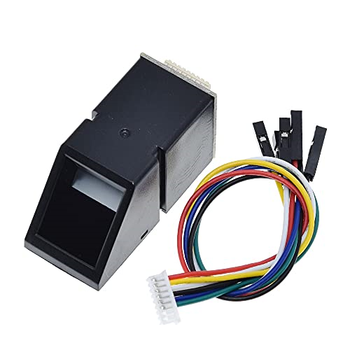</td>
  </tr>

  <tr>
    <td><strong>Ultrasonic Sensor</strong></td>
    <td>Measures distance by emitting ultrasonic waves and calculating the echo time. Widely used in obstacle detection, robotics, and parking systems.</td>
    <td align="center"></td>
  </tr>

  <tr>
    <td><strong>Water Level Sensor</strong></td>
    <td>Detects the presence and height of water. Commonly used in water tanks, flood detection systems, and irrigation projects.</td>
    <td align="center">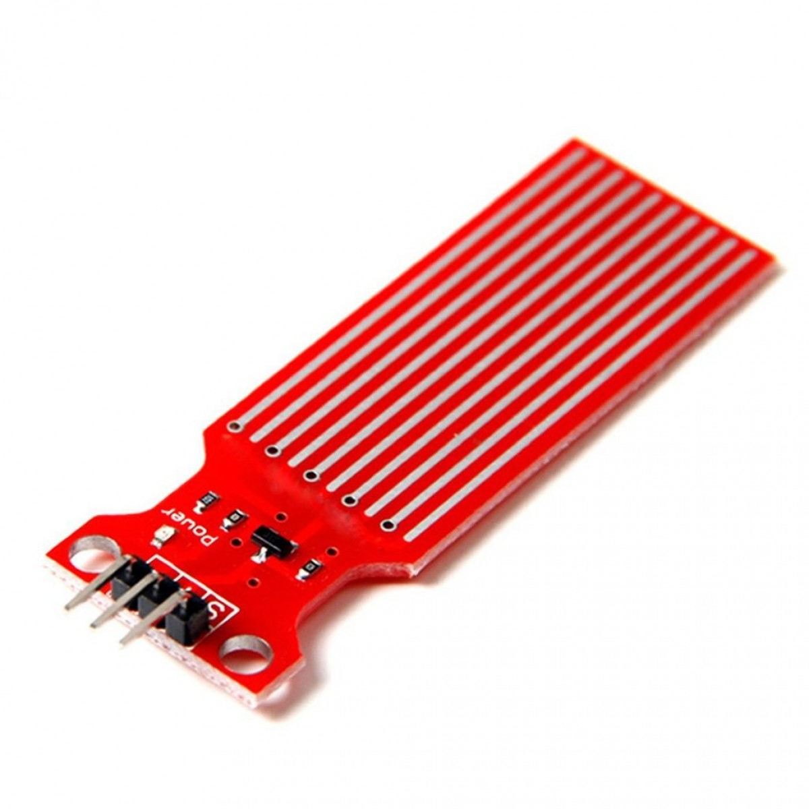</td>
  </tr>

  <tr>
    <td><strong>Sound Sensor</strong></td>
    <td>Detects sound intensity using a microphone module. Used in noise detection, clap switches, and audio-based automation projects.</td>
    <td align="center"></td>
  </tr>

  <tr>
    <td><strong>Temperature & Humidity Sensor</strong></td>
    <td>Measures ambient temperature and humidity. Commonly used in weather monitoring, smart homes, and environmental systems.</td>
    <td align="center"></td>
  </tr>

  <tr>
    <td><strong>Soil Moisture Sensor</strong></td>
    <td>Detects moisture levels in soil. Frequently used in smart irrigation and agricultural monitoring systems.</td>
    <td align="center">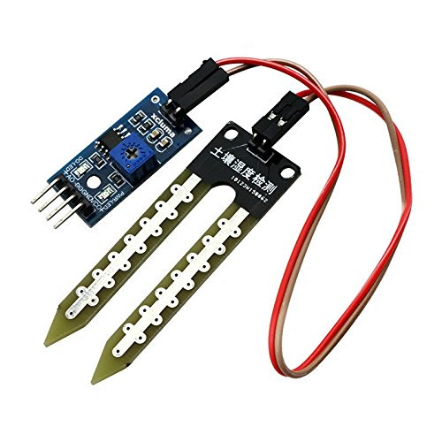</td>
  </tr>

  <tr>
    <td><strong>Flame Sensor</strong></td>
    <td>Detects the presence of fire or flame using infrared light. Used in fire alarm and safety systems.</td>
    <td align="center"></td>
  </tr>

  <tr>
    <td><strong>Touch Sensor</strong></td>
    <td>Detects physical touch or contact. Often used as an alternative to buttons and switches in interactive projects.</td>
    <td align="center"></td>
  </tr>

  <tr>
    <td><strong>Smoke & Gas Sensor</strong></td>
    <td>Detects smoke and harmful gases such as LPG or methane. Commonly used in safety and air-quality monitoring systems.</td>
    <td align="center">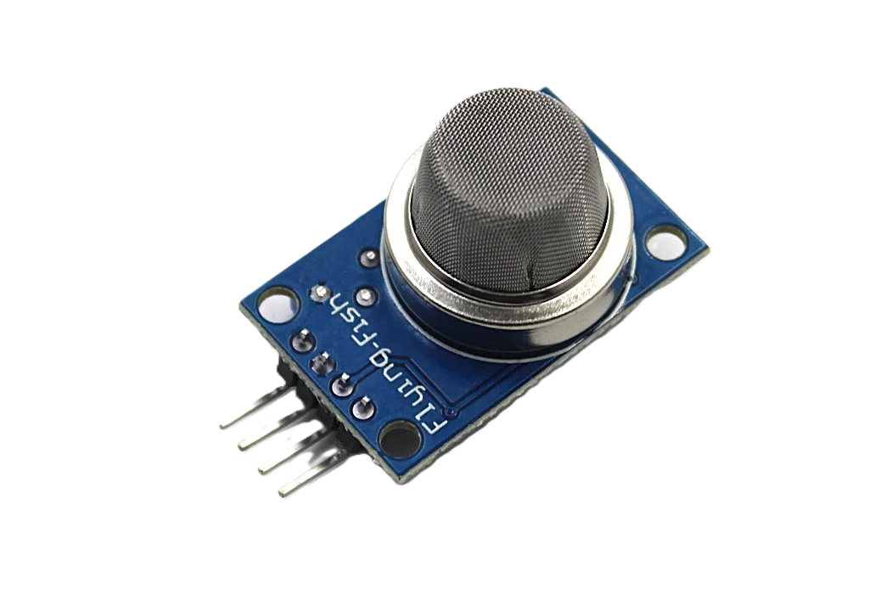</td>
  </tr>

  <tr>
    <td><strong>RFID Sensor</strong></td>
    <td>Uses radio frequency to read and identify RFID tags. Widely used in access control, attendance systems, and inventory tracking.</td>
    <td align="center">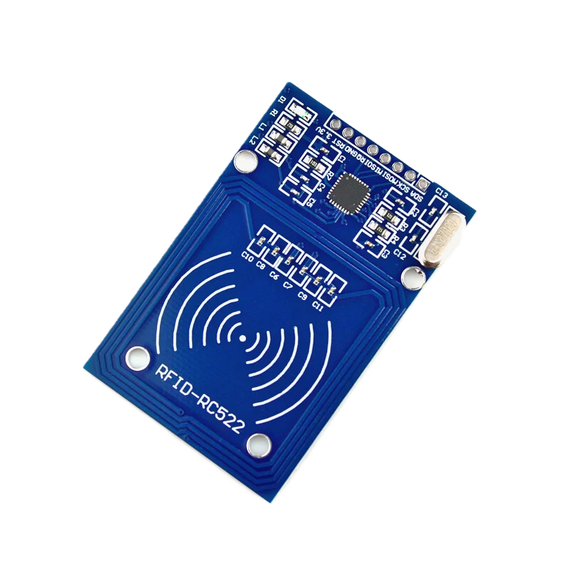</td>
  </tr>
</table>

---

## ▢ Main Page & Sensor Dictionary

<table>
  <tr>
    <td align="center">
      <strong>Landing Page</strong> 
      

        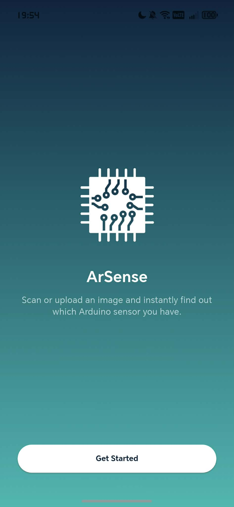
      

      The landing page of ArSense app
    </td>
    <td align="center">
      <strong>Home Screen</strong> 
      

        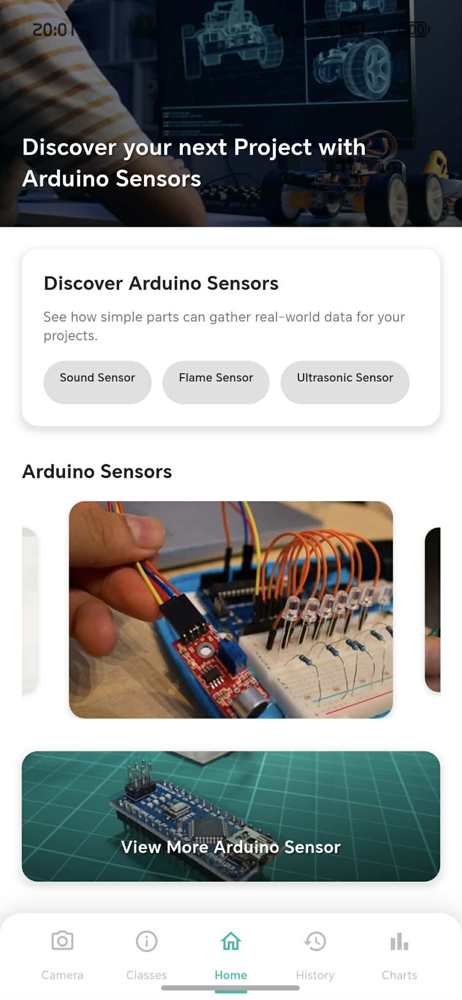
      

      Home screen with navigation options
    </td>
    <td align="center">
      <strong>Home Overview Sensor</strong> 
      

        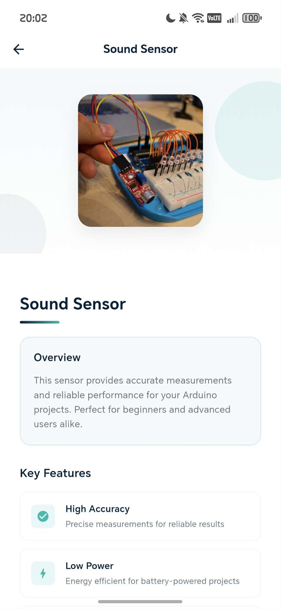
      

      Sensor overview and information display
    </td>
  </tr>
</table>

<table>
  <tr>
    <td align="center">
      <strong>Class Info</strong> 
      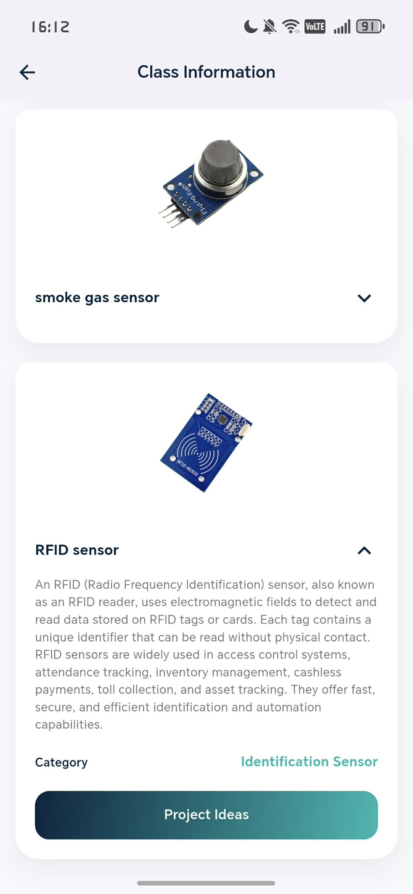 
      Sensor information and specifications
    </td>
    <td align="center">
      <strong>Project Ideas</strong> 
      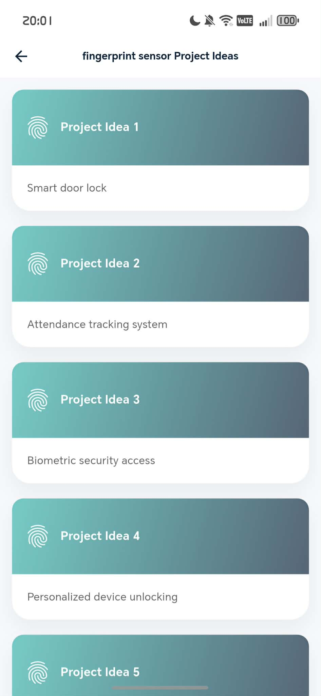 
      Project ideas for Arduino sensors
    </td>
  </tr>
</table>

## ▢ Capture or Upload Images & Classification Result

<table>
  <tr>
    <td align="center">
      <strong>Camera Onboard</strong> 
      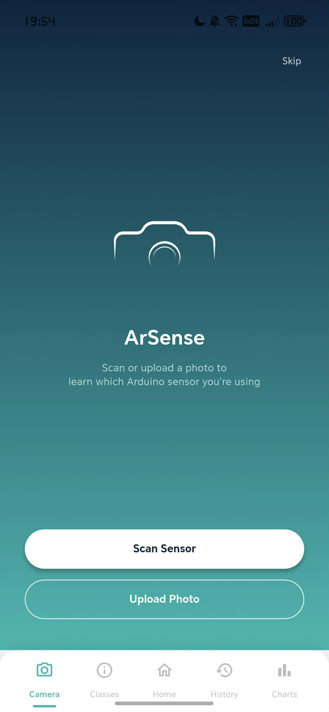 
      Camera interface for capturing sensor
    </td>
    <td align="center">
      <strong>Upload Screen</strong> 
      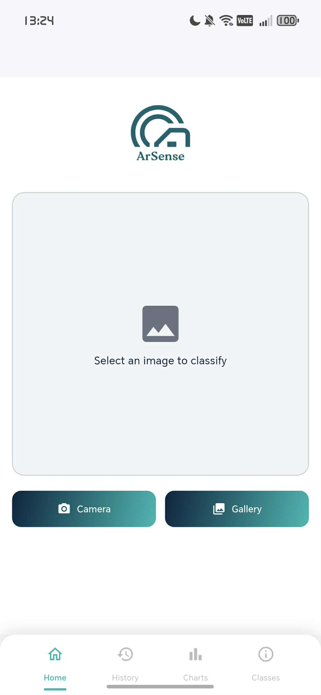 
      Upload existing images from gallery
    </td>
    <td align="center">
      <strong>Classification Result</strong> 
      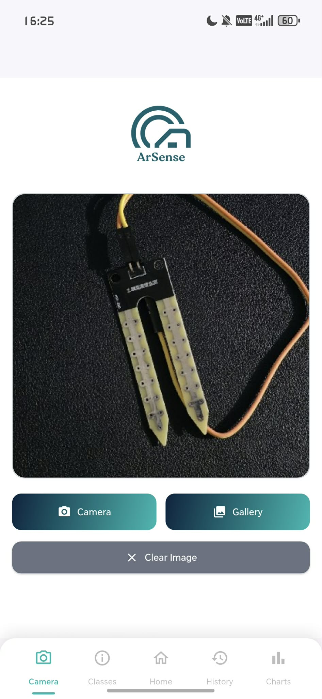 
        Arduino Sensor successfully captured image
    </td>
    <td align="center">
      <strong>Classification Result</strong> 
      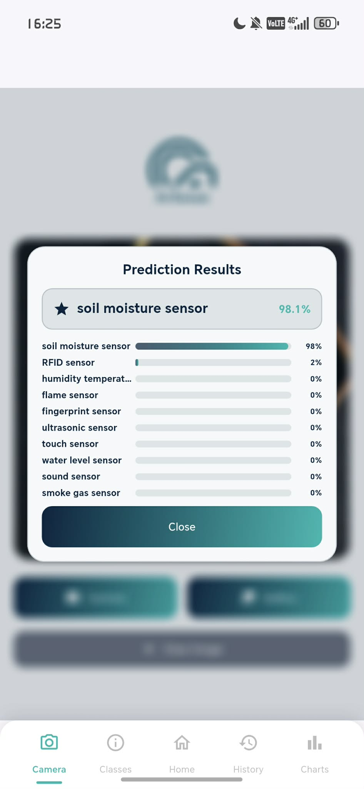 
      Results with confidence percentages.
    </td>
  </tr>
</table>

---

## ▢ Analytics, Detections per Sensor & Scan History

<table>
  <tr>
    <td align="center">
      <strong>Chart Screen 1</strong> 
      

        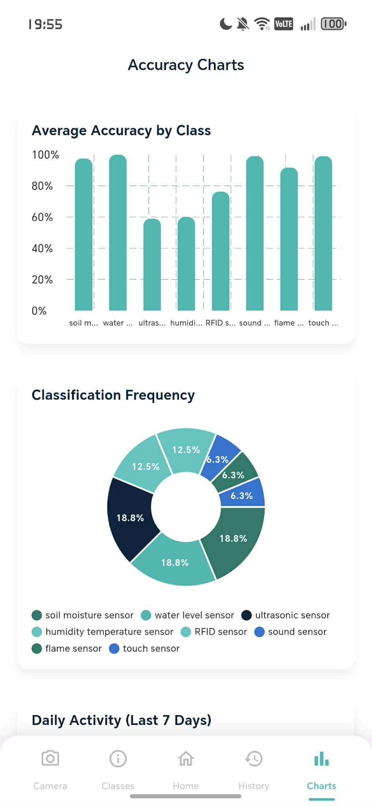
      

      Analytics showing detection frequency
    </td>
    <td align="center">
      <strong>Chart Screen 2</strong> 
      

        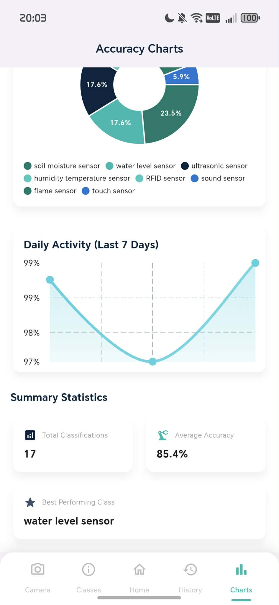
      

      Detailed analytics visualization
    </td>
    <td align="center">
      <strong>History Screen 1</strong> 
      

        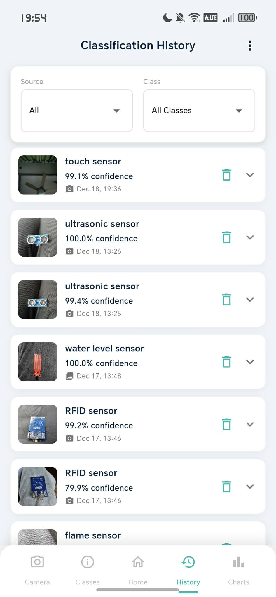
      

      Scan history overview with details
    </td>
    <td align="center">
      <strong>History Screen 2</strong> 
      

        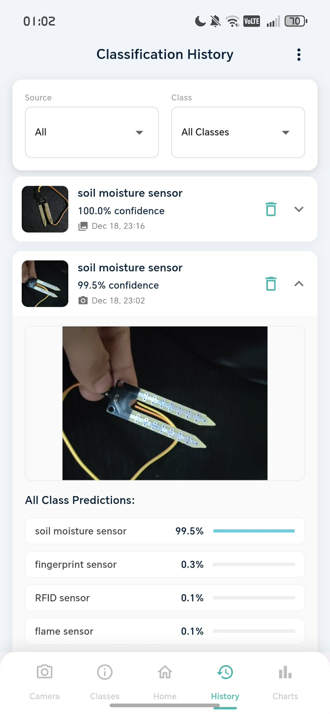
      

      Detailed scan history with timestamps
    </td>
  </tr>
</table>

---
## ▢ Key Features Summary

<table>
  <tr>
    <th align="left">Feature</th>
    <th align="left">Description</th>
  </tr>

  <tr>
    <td><strong>Image Capture & Upload</strong></td>
    <td>Users can capture real-time photos or upload existing images to classify Arduino sensors.</td>
  </tr>

  <tr>
    <td><strong>Arduino Sensor Recognition</strong></td>
    <td>The app uses an image classification model to identify different Arduino sensor modules.</td>
  </tr>

  <tr>
    <td><strong>Confidence-Based Results</strong></td>
    <td>Classification results include confidence percentages to show prediction accuracy.</td>
  </tr>

  <tr>
    <td><strong>Interactive Sensor Dictionary</strong></td>
    <td>A built-in reference section for learning about supported Arduino sensors.</td>
  </tr>

  <tr>
    <td><strong>Project Ideas per Sensor</strong></td>
    <td>
      Each sensor entry in the dictionary includes a <strong>“Project Ideas”</strong> button that displays practical Arduino project ideas that can be created using the selected sensor.
    </td>
  </tr>

  <tr>
    <td><strong>Usage Analytics</strong></td>
    <td>Provides insights into sensor detection frequency and app usage.</td>
  </tr>

  <tr>
    <td><strong>Scan History</strong></td>
    <td>Keeps a record of previous scans for review and learning purposes.</td>
  </tr>
</table>

---

